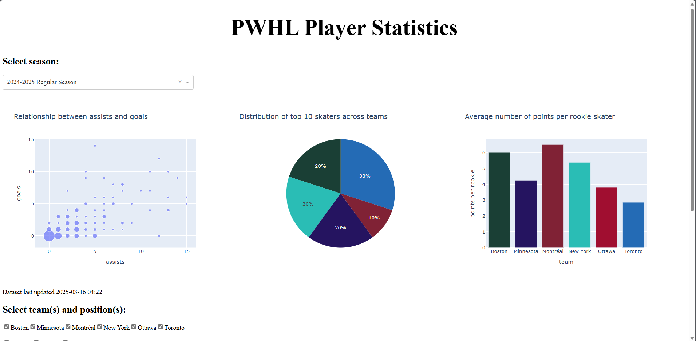

# pwhl_data-analysis

## Project Overview

This project contains files to scrape PWHL player data, save it in a CSV file and display it in the form of a dashboard.



## Files

### Files Showing the Development Process

* `skater_stats_to_csv.ipynb`: A notebook showing how to create a dataset from PWHL skater statistics and save it as a CSV file.
* `skater_stats.csv`: A sample CSV file containing PWHL skater statistics.
* `visualizations.ipynb`: A notebook showing how to create different types of visualizations based on skater statistics.

### Files Showing the Dashboard

The `visual_samples` folder contains screen captures of the dashboard.

### Files To Run the Dashboard

* `step1_get_stats.py`: A script to scrape the data and save it into a CSV file.
* `full_stats.csv`: A CSV file generated using `step1_get_stats.py`.
* `step2_run_dashboard.py`: A script to run the interactive dashboard.

## Script Dependencies

The scripts require Python to be installed.

To run the scripts (`.py` files), need certain packages installed. For example, I had to run the following commands in command line/terminal before the scripts.

```
pip install setuptools
python -m pip 
python -m pip install packaging
python -m pip install pandas dash
python -m pip install selenium
pip install httpx==0.20 dash plotly
pip install dash_bootstrap_components
pip install dash_bootstrap_templates
```

An easy way to see if you are lacking anything is to try to run the script, then install the appropriate package if you get an error message about missing dependencies.

`step1_get_stats.py` needs a WebDriver to be installed. Consult [the supported browsers section of the Selenium downloads page](https://www.selenium.dev/downloads/#supported-browsers) for more information. If not using Edge, update line 24 of `step1_get_stats.py` with the appropriate WebDriver.

## Running a Python script

To run a script, use the following command:

```
python <path>/<filename>
```

## Running the Scripts and Accessing the Dashboard

First, run `step1_get_stats.py`. WebDriver will open and close multiple webpages displaying PWHL player statistics. Wait for the script to end. It will output "Step 1 complete."

**NOTE 1**: It is normal for the script to take a while as it needs to open a large number of webpages (46 at time of writing), waiting for each to load the table, then scraping the data.

**NOTE 2**: You may see a list of WebDriver-related warnings and errors in the console. They should not prevent the script from completing.

Then, run `step2_run_dashboard.py`. Its output should specify which port it is running on.

Example with port 8050:

```
 * Serving Flask app 'step2_run_dashboard'
 * Debug mode: off
 * Running on http://127.0.0.1:8050
```

## References

- [Layout - dbc docs](https://dash-bootstrap-components.opensource.faculty.ai/docs/components/layout/): How to create an app layout with Dash and Bootstrap.
